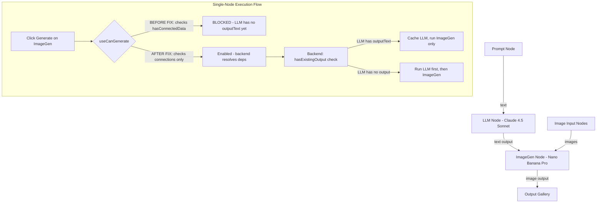
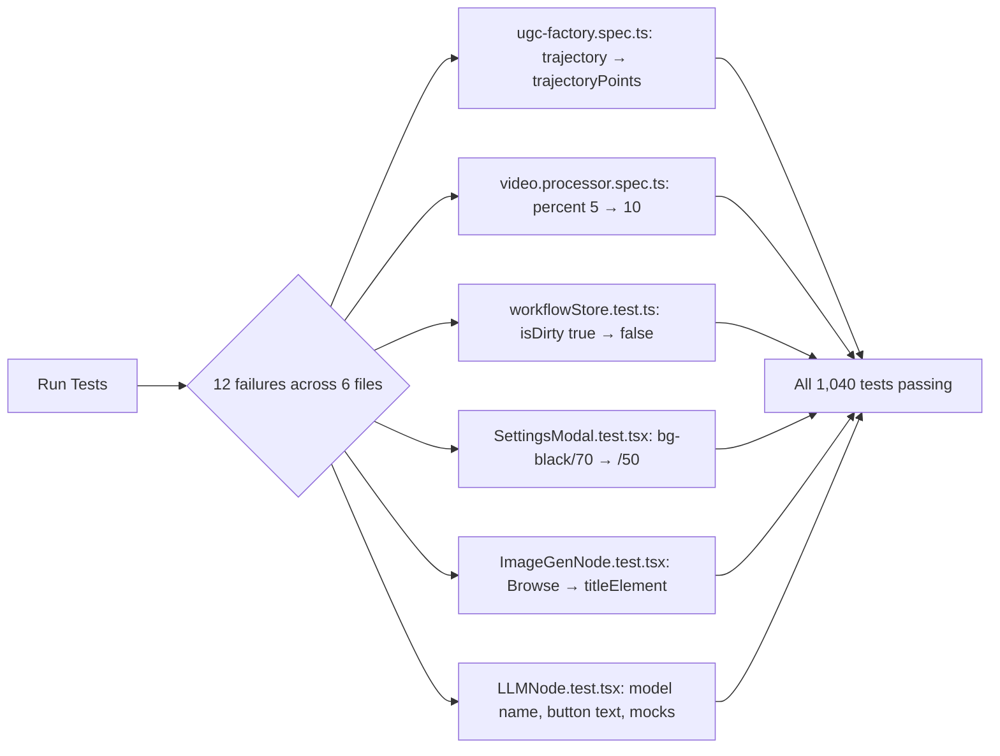

# 2026-02-05 Sessions

---

## Session 1: KlingQuality Enum Migration, canGenerate Fix, Output Gallery & LLM Node Improvements

**Time:** ~2:00 AM
**Context:** Continued from previous session (context compacted). Major focus on enum migration, fixing single-node execution validation, and multiple UX/backend fixes.

### System Flow Diagram

### Affected Components

| Layer | Components |
|-------|-----------|
| Frontend | `useCanGenerate.ts`, `ImageGenNode.tsx`, `LLMNode.tsx`, `nodeSlice.ts`, `WorkflowCanvas.tsx`, `OutputGalleryNode.tsx` |
| Backend | `video.processor.ts`, `replicate.service.ts`, `job-data.interface.ts`, `llm.processor.ts` |
| Types | `enums.ts`, `ai-nodes.ts`, `registry.ts` |
| API Route | `providers/models/route.ts` |

### What Was Done

- [x] **KlingQuality enum migration** - Replaced string literals `'pro'`/`'standard'` with `KlingQuality.PRO`/`KlingQuality.STANDARD` enum values
  - Created `KlingQuality` enum in `packages/types/src/enums.ts`
  - Updated `MotionControlJobData` interface to use `qualityMode?: KlingQuality`
  - Updated `video.processor.ts` to use enum for quality comparison
  - Updated `replicate.service.ts` `MotionControlInput.quality` to use `KlingQuality` type
  - Added proper imports across all files
- [x] **Fixed canGenerate blocking single-node execution** - Removed `hasConnectedData` from `canGenerate` formula
  - `canGenerate` now only requires: connections exist + schema fields valid
  - Backend handles dependency resolution (runs upstream nodes first)
  - `hasConnectedData` kept as informational field but doesn't block Generate button
- [x] **Output Gallery accumulation fix** (from earlier in session) - Gallery now accumulates images across runs instead of replacing
- [x] **LLM Node improvements** (from earlier in session):
  - Improved output display: "Generated Output" label, max-h-48 scrollable, primary-tinted border
  - Added required validation: system prompt + input prompt required
  - Empty prompt node invalidates Generate button
  - Added Claude 4.5 Sonnet as LLM model option
- [x] **Fixed LLM prompt not reaching API** - Backend processor reads `inputPrompt ?? prompt` (field name mismatch fix)
- [x] **Edge animations for single-node execution** - Added CSS animations matching full workflow execution
- [x] **Expert agent review** - Ran 4 expert agents for code cleanup (memoization, shallow comparison, comment cleanup)
- [x] **Linter fixes** - Biome formatting fix, TypeScript pre-existing errors only

### Key Decisions

| Decision | Rationale |
|----------|-----------|
| Remove `hasConnectedData` from `canGenerate` | Backend resolves dependencies - frontend should only validate connections exist, not upstream data |
| Keep `hasConnectedData` as informational field | Other code may use it for display purposes without blocking |
| Use `KlingQuality` enum (STANDARD='std', PRO='pro') | User requested enums for all string literal unions; matches Kling API values |
| `qualityMode` field name (not `quality`) | Matches frontend `MotionControlNodeData.qualityMode` field name |

### Files Changed

**Frontend:**
- `apps/web/src/hooks/useCanGenerate.ts` - Removed `hasConnectedData` from `canGenerate` formula
- `apps/web/src/components/nodes/ai/ImageGenNode.tsx` - (earlier) improved validation display
- `apps/web/src/components/nodes/ai/LLMNode.tsx` - (earlier) output display, required fields, Claude model
- `apps/web/src/store/workflow/slices/nodeSlice.ts` - (earlier) gallery accumulation fix
- `apps/web/src/components/canvas/WorkflowCanvas.tsx` - (earlier) single-node edge animations
- `apps/web/src/app/api/providers/models/route.ts` - (earlier) Claude 4.5 Sonnet in model browser
- `apps/web/src/lib/models/registry.ts` - (earlier) Claude model registry entry

**Backend:**
- `apps/api/src/processors/video.processor.ts` - KlingQuality enum import + usage
- `apps/api/src/services/replicate.service.ts` - KlingQuality enum for MotionControlInput.quality type
- `apps/api/src/interfaces/job-data.interface.ts` - `qualityMode?: KlingQuality` + runtime import
- `apps/api/src/processors/llm.processor.ts` - (earlier) `inputPrompt ?? prompt` fix

**Types Package:**
- `packages/types/src/enums.ts` - Added `KlingQuality` enum
- `packages/types/src/nodes/ai-nodes.ts` - Re-exports `KlingQuality`, `KlingQualityMode` type alias

### Mistakes and Fixes

| Mistake | Fix |
|---------|-----|
| `useCanGenerate` required upstream data to exist before enabling Generate | Removed `hasConnectedData` from canGenerate - backend handles deps |
| Zustand infinite loop with `Array.from()` in selector | Use Map reference directly, add boolean selector |
| LLM processor read `nodeData.prompt` but frontend sends `inputPrompt` | Changed to `inputPrompt ?? prompt` pattern |
| `video.processor.ts` used `data.nodeData.quality` (wrong field name) | Changed to `data.nodeData.qualityMode` with enum |
| Import `type KlingQuality` prevented runtime enum usage | Changed to value import `KlingQuality` |

### Next Steps

- [ ] Verify LLM output is visible in node after single-node execution (user concern)
- [ ] Verify backend caching works for single-node ImageGen execution (LLM should be skipped)
- [ ] Consider adding cached output caching to full workflow execution (currently only partial execution caches)
- [ ] User may want a "confirm prompt" step in LLM workflow - currently fire-and-forget
- [ ] Run full integration test: Prompt → LLM → ImageGen with single-node execution on ImageGen

---

## Session 2: Insights Review & Tooling Setup

**Time:** Evening

### What Was Done

- [x] **Added CLAUDE.md sections from insights recommendations**
  - `## React / State Management` — referential equality checks for selectors to prevent infinite re-render loops
  - `## Development Workflow` — verify fixes in running dev server before assuming failure
  - `## API Routes` — validate route file paths match URL patterns, test with curl
- [x] **Created post-edit type-check hook** (`.claude/settings.json`)
  - `postToolUse` hook runs `npx tsc --noEmit` after every Edit/Write operation
  - Catches type errors immediately instead of compounding across edits
- [x] **Created `/bugfix` skill** (`.claude/skills/bugfix/SKILL.md`)
  - 6-step workflow: reproduce → root cause → fix → tsc → grep similar → verify routes
  - Enforces verification steps to reduce buggy code friction
- [x] **Parallel agent investigation of OutputGallery image flow**
  - Agent 1: Traced full 9-step data flow from execution to gallery render
  - Agent 2: Found HIGH severity bug — `propagateOutputsDownstream()` exits early when `outputImages` is `[]` (empty array)
  - Agent 3: Confirmed rendering logic is solid — no bugs in OutputGalleryNode component
- [x] **Established prompt scaffold templates** for future sessions
  - Fix Plan template (file + change + reason per step)
  - Verify Fix template (tsc + grep + curl)
  - Batch Bugs template (shared context + multiple descriptions)

### Key Decisions

| Decision | Rationale |
|----------|-----------|
| Add tsc hook on Edit/Write | Insights showed 298 buggy_code friction events; catching type errors immediately reduces iteration cycles |
| Create bugfix skill with verification steps | 35% dissatisfied rate from unverified fixes; enforce root cause analysis before changes |
| Use prompt scaffolds as templates | User operates as high-throughput orchestrator; standardized prompts yield cleanest results |

### Files Changed

- `CLAUDE.md` (workspace root) — Added Common Pitfalls, UI Changes, Debugging, Workflow sections
- `core/CLAUDE.md` — Added React/State Management, Development Workflow, API Routes sections
- `core/.claude/settings.json` — Created with postToolUse tsc hook
- `core/.claude/skills/bugfix/SKILL.md` — Created bugfix workflow skill

### Bug Found (Not Yet Fixed)

| Bug | Severity | Location | Issue |
|-----|----------|----------|-------|
| Empty array short-circuit | HIGH | `nodeSlice.ts:282` | `propagateOutputsDownstream()` exits early when `outputImages` is `[]` because `getNodeOutput()` returns `null` for empty arrays |

### Next Steps

- [ ] Fix the empty array short-circuit bug in `nodeSlice.ts` `getNodeOutput()` / `propagateOutputsDownstream()`
- [ ] Verify LLM output visible after single-node execution (carried from Session 1)
- [ ] Run full integration test: Prompt → LLM → ImageGen → OutputGallery

---

## Session 3: Fix All Failing Tests Across Project

**Time:** ~3:05 AM
**Context:** User requested finding and fixing all failing tests in the project.

### System Flow Diagram

### Affected Components

| Layer | Components |
|-------|-----------|
| Workflows Package | `__tests__/ugc-factory.spec.ts` |
| API Tests | `processors/video.processor.spec.ts` |
| Frontend Tests | `workflowStore.test.ts`, `SettingsModal.test.tsx`, `ImageGenNode.test.tsx`, `LLMNode.test.tsx` |

### What Was Done

- [x] **Ran full test suite** across all 5 packages (core, prompts, types, workflows, api, web) — 62 test files, 1,040 tests
- [x] **Fixed ugc-factory.spec.ts** — Test used `trajectory` but type uses `trajectoryPoints`
- [x] **Fixed video.processor.spec.ts** — `startJob()` in base processor uses `percent: 10`, test expected `5`
- [x] **Fixed workflowStore.test.ts** — `loadWorkflow()` now sets `isDirty: false` after propagation, test expected `true`
- [x] **Fixed SettingsModal.test.tsx** — Modal backdrop class changed from `bg-black/70` to `bg-black/50`
- [x] **Fixed ImageGenNode.test.tsx (4 tests)** — "Browse" button removed, replaced with clickable model name; updated BaseNode mock to render `titleElement`
- [x] **Fixed LLMNode.test.tsx (4 tests)** — Updated model display name, button text, added missing mocks (`useAutoLoadModelSchema`, `useModelSelection`, registry, `ModelBrowserModal`), provided valid `systemPrompt`/`inputPrompt` for `canGenerate`

### Key Decisions

| Decision | Rationale |
|----------|-----------|
| Fix tests to match source, not source to match tests | All source changes were intentional from Session 1/2; tests were stale |
| Update BaseNode mock to render `titleElement` | Source moved model browsing to `titleElement` prop; mock didn't render it |
| Add missing hook mocks to LLMNode test | Component added `useAutoLoadModelSchema`, `useModelSelection`, `ModelBrowserModal` imports that weren't mocked |
| Change LLM "Generating" test to not check disabled | Generating button is now a stop button (destructive variant), intentionally clickable |

### Files Changed

- `packages/workflows/__tests__/ugc-factory.spec.ts` — `trajectory` → `trajectoryPoints`
- `apps/api/src/processors/video.processor.spec.ts` — `percent: 5` → `percent: 10`
- `apps/web/src/store/workflowStore.test.ts` — `isDirty: true` → `isDirty: false`
- `apps/web/src/components/settings/SettingsModal.test.tsx` — `bg-black\\/70` → `bg-black\\/50`
- `apps/web/src/components/nodes/ai/ImageGenNode.test.tsx` — BaseNode mock + Browse → title selectors
- `apps/web/src/components/nodes/ai/LLMNode.test.tsx` — Model name, button text, missing mocks, canGenerate validation

### Mistakes and Fixes

| Mistake | Fix |
|---------|-----|
| First ImageGenNode fix used `getByTitle('Browse models')` but BaseNode mock didn't render `titleElement` | Added `titleElement` to BaseNode mock |
| LLM `queryByText('Generate')` would find headerActions button when checking body | Changed test to check `getByText('Generated output')` instead |
| LLM refresh button test found title button instead of refresh button | Used `getByTitle('Regenerate')` for precise targeting |

### Test Results

| Package | Tests | Status |
|---------|-------|--------|
| packages/core | 80 | ✅ All passing |
| packages/prompts | 10 | ✅ All passing |
| packages/types | 22 | ✅ All passing |
| packages/workflows | 20 | ✅ All passing |
| apps/api | 371 | ✅ All passing |
| apps/web | 589 | ✅ All passing |
| **Total** | **1,040** | **✅ All passing** |

### Next Steps

- [ ] Fix the empty array short-circuit bug in `nodeSlice.ts` (carried from Session 2)
- [ ] Verify LLM output visible after single-node execution (carried from Session 1)
- [ ] Run full integration test: Prompt → LLM → ImageGen → OutputGallery (carried)

---
