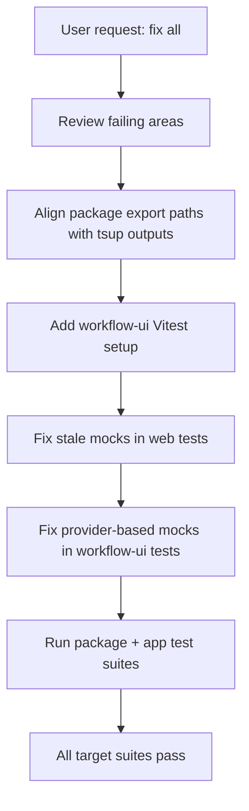

# Session: 2026-02-11

## Summary
Created the LoRA Dataset Generator workflow — a single-canvas workflow for generating 20 varied training images from 3 reference identity photos across 4 angle groups.

## Tasks Completed
- [x] Created 4 separate workflow JSON files (run1-frontal, run2-three-quarter, run3-profiles, run4-variety)
- [x] Merged all 4 runs into single workflow `lora-dataset-generator.json` per user request
- [x] Deleted the 4 separate workflow files
- [x] Updated `catalog.json` — consolidated 4 entries into 1
- [x] Validated JSON parsing, edge counts (100), node counts (44), and handle correctness

## Files Created
- `packages/workflows/workflows/lora-dataset-generator.json` — single-canvas workflow with 44 nodes, 100 edges

## Files Modified
- `packages/workflows/metadata/catalog.json` — added 1 entry for `lora-dataset-generator`

## Files Deleted
- `packages/workflows/workflows/lora-dataset-run1-frontal.json`
- `packages/workflows/workflows/lora-dataset-run2-three-quarter.json`
- `packages/workflows/workflows/lora-dataset-run3-profiles.json`
- `packages/workflows/workflows/lora-dataset-run4-variety.json`

## Architecture Decisions
- **Single canvas, not 4 separate files**: User requested all runs on one canvas. Runs are visually grouped with 300px Y-gaps between groups so they can be selectively triggered.
- **Node naming**: Prompts/generators labeled by group (Frontal 1-5, 3/4 View 1-5, Profile 1-5, Variety 1-5) for easy identification on canvas.
- **All 3 imageInputs connect to all 20 imageGens**: 60 image edges ensure every reference photo feeds every generator.

## Workflow Structure
- 3 imageInputs (x=50, y=50/200/350) — shared reference photos
- 20 prompts (x=50) — 5 per group, grouped with 300px gaps
- 20 imageGens (x=450) — aligned with their prompts, model: nano-banana-pro, 4:5, 2K, png
- 1 outputGallery (x=850, y=2000) — centered, collects all 20 outputs
- 100 edges: 60 image + 20 prompt + 20 output

## Patterns Used
- Node defaultData shapes copied from `packages/types/src/nodes/registry.ts`
- Edge naming: sequential `e1`-`e100`
- Handle IDs: imageInput→`image`, prompt→`text`, imageGen inputs `prompt`/`images`, outputGallery input `image`
- Workflow JSON: version 1, edgeStyle smoothstep (matches existing workflows)

## Verified
- Screenshot confirms workflow renders correctly in app
- All JSON files parse, edge/node counts match expectations

---

## Session 2: Fix-all follow-up (exports + tests hardening)

**Duration:** ~1.2 hours  
**Status:** Complete

### System flow diagram



### Affected components

- Frontend app tests (`apps/web`)
- Shared package metadata (`packages/*/package.json`)
- Workflow UI package tests/config (`packages/workflow-ui`)
- Lockfile (`bun.lock`)

### What was done

- Corrected ESM/CJS export path mismatches in package manifests to match actual build outputs (`.mjs` for import, `.js` for require).
- Added `workflow-ui` test runtime wiring (`vitest.config.ts`, `vitest.setup.ts`) and package test dependencies/scripts.
- Updated web tests to mock store imports from `@genfeedai/workflow-ui/stores` after migration.
- Updated `workflow-ui` node tests to mock provider-injected UI components via `useWorkflowUIConfig()` instead of old app-level module paths.
- Re-ran `workflow-ui`, web, and API suites to verify no regressions.

### Key decisions

- **Decision:** Mock `../../provider` in `workflow-ui` tests rather than app-specific modal/picker modules.
  - **Rationale:** Components now resolve optional UI integrations through `WorkflowUIProvider`; tests must follow the same contract to remain stable across app implementations.
- **Decision:** Keep package export fixes at manifest level without changing build tooling.
  - **Rationale:** Build outputs were already correct; failures were from stale manifest paths only.

### Files changed

- `packages/types/package.json`
- `packages/core/package.json`
- `packages/prompts/package.json`
- `packages/workflows/package.json`
- `packages/workflow-ui/package.json`
- `packages/workflow-ui/vitest.config.ts` (new)
- `packages/workflow-ui/vitest.setup.ts` (new)
- `apps/web/src/components/settings/SettingsModal.test.tsx`
- `apps/web/src/components/workflow/GenerateWorkflowModal.test.tsx`
- `packages/workflow-ui/src/nodes/ai/ImageGenNode.test.tsx`
- `packages/workflow-ui/src/nodes/input/PromptNode.test.tsx`
- `bun.lock`

### Mistakes and fixes

- **Mistake:** Initial `workflow-ui` tests still mocked old app-level modules (`@/components/...`) after provider injection migration.
- **Fix:** Replaced with `useWorkflowUIConfig()` mocks in `../../provider` to match runtime architecture.
- **Prevention:** For shared package tests, always mock package-local provider contracts instead of app aliases.

### Validation

- `bun run --cwd packages/workflow-ui test` ✅ (14 files, 303 tests)
- `bun run test:web` ✅ (32 files, 571 tests)
- `bun run test:api` ✅ (21 files, 371 tests)

### Next steps

- [ ] Optionally clean non-fatal warning noise in tests (`unoptimized` attribute warning, MSW unhandled-request logs in negative-path tests).
- [ ] Commit/push this fix-all batch when ready.

---

## Session 3: Optional warning cleanup (non-blocking)

**Duration:** ~0.3 hours  
**Status:** Complete

### What was done

- Added missing MSW handler for execution stop endpoint to eliminate unhandled-request noise in web tests.
- Updated `next/image` mock in `AnnotationNode` test to avoid forwarding framework-only props to DOM and remove React attribute warning.

### Files changed

- `apps/web/src/test/mocks/handlers.ts`
- `packages/workflow-ui/src/nodes/processing/AnnotationNode.test.tsx`

### Verification

- `bun run --cwd packages/workflow-ui test -- src/nodes/processing/AnnotationNode.test.tsx` ✅
- `bun run --cwd apps/web test -- src/store/executionStore.test.ts` ✅
- `bun run --cwd packages/workflow-ui test` ✅
- `bun run test:web` ✅

### Notes

- Cleared warnings:
  - React DOM warning for `unoptimized` attribute in `workflow-ui` tests
  - MSW unhandled request warning for `POST /executions/:id/stop`
- Remaining stderr lines in web tests are expected negative-path logger output from tests that intentionally simulate failures.

---

## Session 3: Critical bug fixes — GlobalImageHistory, context menu, delete key, Set as Thumbnail, LoRA template

**Status:** Complete

### What was done

1. **Fixed GlobalImageHistory crash** — `state.globalImageHistory` was undefined, causing `Cannot read properties of undefined (reading 'slice')`. Added `?? EMPTY_HISTORY` fallback with stable reference to avoid `useSyncExternalStore` infinite loop.

2. **Ported entire context menu system** — All 4 context menu handlers in `WorkflowCanvas.tsx` were completely stubbed out (only `event.preventDefault()`) since the initial workflow-ui package creation. Ported 13+ files from `apps/web/` to `packages/workflow-ui/`:
   - `contextMenuStore.ts` — Zustand store
   - `ContextMenu.tsx`, `ContextMenuItem.tsx`, `ContextMenuSeparator.tsx` — UI components
   - `nodeMenu.tsx`, `edgeMenu.tsx`, `paneMenu.tsx`, `selectionMenu.tsx` — Menu builders
   - `useContextMenu.ts`, `useNodeActions.ts`, `usePaneActions.ts` — Hooks
   - `autoLayout.ts` — Dagre-based layout utility

3. **Restored delete key** — Was `deleteKeyCode={null}`, changed to `deleteKeyCode={['Backspace', 'Delete']}`.

4. **Wired "Set as Thumbnail"** — Added `WorkflowsApiService` interface to `WorkflowUIConfig` provider types. Wired `workflowsApi.setThumbnail` through provider injection in `apps/web/src/app/workflows/[id]/page.tsx`.

5. **Added LoRA Dataset Generator to API seed** — Template JSON existed in `packages/workflows/` but was never added to `apps/api/src/templates/templates.seed.ts`. Added full template (44 nodes, 100 edges). Verified it appears in Template Explorer.

### Files created

- `packages/workflow-ui/src/stores/contextMenuStore.ts`
- `packages/workflow-ui/src/components/context-menu/ContextMenu.tsx`
- `packages/workflow-ui/src/components/context-menu/ContextMenuItem.tsx`
- `packages/workflow-ui/src/components/context-menu/ContextMenuSeparator.tsx`
- `packages/workflow-ui/src/components/context-menu/menus/nodeMenu.tsx`
- `packages/workflow-ui/src/components/context-menu/menus/edgeMenu.tsx`
- `packages/workflow-ui/src/components/context-menu/menus/paneMenu.tsx`
- `packages/workflow-ui/src/components/context-menu/menus/selectionMenu.tsx`
- `packages/workflow-ui/src/components/context-menu/menus/index.ts`
- `packages/workflow-ui/src/components/context-menu/index.ts`
- `packages/workflow-ui/src/hooks/useContextMenu.ts`
- `packages/workflow-ui/src/hooks/useNodeActions.ts`
- `packages/workflow-ui/src/hooks/usePaneActions.ts`
- `packages/workflow-ui/src/lib/autoLayout.ts`

### Files modified

- `packages/workflow-ui/src/components/GlobalImageHistory.tsx`
- `packages/workflow-ui/src/canvas/WorkflowCanvas.tsx`
- `packages/workflow-ui/src/hooks/index.ts`
- `packages/workflow-ui/src/stores/index.ts`
- `packages/workflow-ui/src/provider/types.ts`
- `packages/workflow-ui/src/provider/index.ts`
- `packages/workflow-ui/package.json` (added `@dagrejs/dagre`)
- `apps/web/src/app/workflows/[id]/page.tsx`
- `apps/api/src/templates/templates.seed.ts`

### Key patterns

- **Stable Zustand selector references**: `const EMPTY_HISTORY: ImageHistoryItem[] = []` defined outside component to prevent `useSyncExternalStore` infinite loops from `?? []` creating new references
- **Provider injection for app-level APIs**: `WorkflowsApiService` added to `WorkflowUIConfig` so workflow-ui stays standalone while receiving `setThumbnail` from the consuming app
- **TS4058 fix**: Types used in return values of exported functions must be exported themselves for tsup DTS generation

### Pending

- All changes uncommitted on `master` — user has not requested a commit

---

## Session 4: README.md overhaul for new contributors

**Status:** Complete

### What was done

Comprehensive update to `README.md` addressing 7 gaps that would block a new contributor from setting up the project:

1. **Added Prerequisites section** — Lists Bun, MongoDB, Redis, Docker with links. Includes hosts file setup (`127.0.0.1 local.genfeed.ai`) with copy-paste commands for macOS/Linux/Windows.
2. **Fixed Quick Start** — Added missing `cp apps/web/.env.example apps/web/.env.local` step.
3. **Fixed Architecture tree** — Replaced non-existent `packages/storage` with actual packages: `workflow-ui`, `workflows`, `prompts`.
4. **Expanded MongoDB Atlas instructions** — Now 8 steps covering account creation, M0 free tier, database user, network access/IP whitelisting, connection string.
5. **Added optional provider sections** — New sections 4-7: ElevenLabs (TTS), Ollama (local LLM), fal.ai (fast inference), Hugging Face.
6. **Expanded Environment Variables** — Split into two grouped tables (API and Web) with Required/Optional columns, covering all variables from both `.env.example` files.
7. **Updated Docker section** — Clarified Docker Compose includes MongoDB + Redis automatically, shows root `.env` file creation, explains `env_file` mechanism.
8. **Removed redundant Database Options section** — Was duplicating Setup Guide content.

### Files modified

- `README.md` — comprehensive overhaul (went from ~285 lines to ~377 lines)

### Decisions

- **Kept existing sections intact** (Features, Node Types, Templates, Tech Stack, Commercial Offering, Contributing, License, Credits) — only modified what was in the plan.
- **Env var names verified** against actual `apps/api/.env.example` and `apps/web/.env.example` files.
- **Architecture tree verified** against actual `packages/` directory listing.

### Pending

- All changes uncommitted on `master` — user has not requested a commit

---

## Session 5: Screenshot Workflow Button

**Status:** Complete

### What was done

Added a Camera button to the workflow toolbar that captures a clean 1920x1080 PNG screenshot of the workflow graph (nodes + edges only, no UI chrome).

- Installed `html-to-image@1.11.13` in `apps/web`
- Added `Camera` icon, React Flow viewport utilities (`useReactFlow`, `getNodesBounds`, `getViewportForBounds`), and `toPng` imports
- Added `handleScreenshot` callback that captures `.react-flow__viewport` DOM element
- Added Camera button between spacer and FolderOpen icon in toolbar

### Files modified

- `apps/web/package.json` — added `html-to-image` dependency
- `apps/web/src/components/toolbar/Toolbar.tsx` — imports, hook, handler, button (~35 lines added)
- `bun.lock` — updated with new dependency

### Toolbar layout

```
[...left side...] | [spacer] | [Camera] [FolderOpen] [Settings]
```

### Edge cases handled

- Empty canvas → no-op (early return)
- Single node → centers and captures
- Many nodes → zooms out to fit all (minZoom 0.5, maxZoom 2, padding 0.15)
- Dark background `#171717` matches editor theme

### Output format

- 1920x1080 PNG
- Filename: `{workflow-name}-screenshot.png`
- Downloads via browser download dialog

### Pending (all sessions)

- All changes uncommitted on `master` — user has not requested a commit
